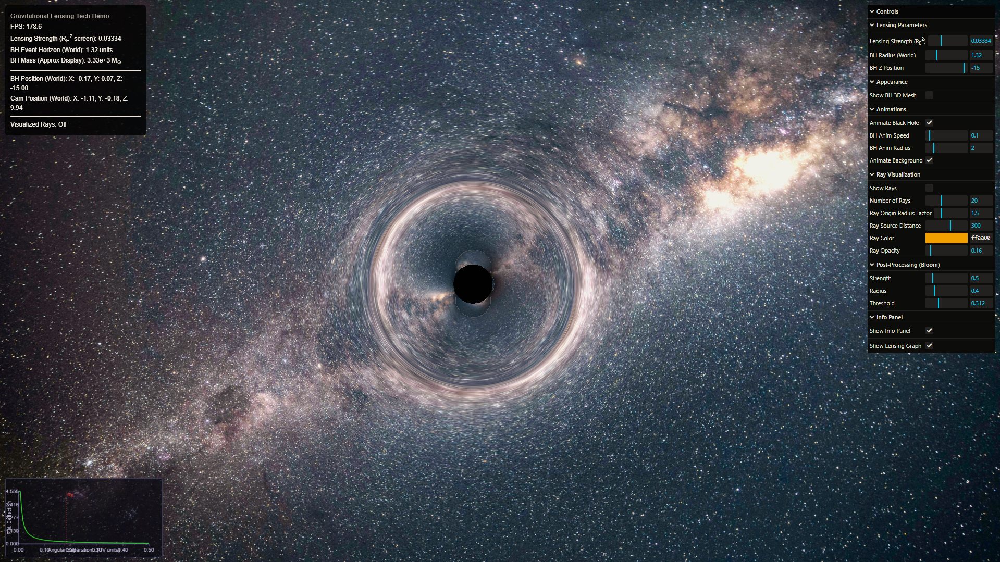

# StellarLens - Overview

**StellarLens** is an interactive, real-time web application that visualizes the mesmerizing phenomenon of gravitational lensing around a black hole. Leveraging advanced 3D graphics, custom shaders, and modern web technologies.

<p align="center">
  
</p>

*Sample: Light rays bending around a black hole, with lensing graph overlay.*

---

## 🔬 Scientific Background

### Schwarzschild Metric and Gravitational Lensing

The Schwarzschild metric describes the spacetime geometry around a non-rotating, spherically symmetric mass such as a black hole. In Schwarzschild coordinates, the line element is:

$$
ds^2 = -\left(1-\frac{2GM}{rc^2}\right)c^2dt^2 + \left(1-\frac{2GM}{rc^2}\right)^{-1}dr^2 + r^2(d\theta^2 + \sin^2\theta d\phi^2)
$$

where $G$ is the gravitational constant, $M$ is the mass of the black hole, $c$ is the speed of light, and $r$ is the radial coordinate. Light rays (null geodesics) passing near the black hole are deflected due to spacetime curvature.

### Einstein Deflection Angle

For a light ray passing at impact parameter $b$ (distance of closest approach), the total deflection angle $\alpha$ in the weak-field limit is:

$$
\alpha \approx \frac{4GM}{c^2 b}
$$

This is the classic Einstein formula for gravitational lensing. For strong lensing (close to the event horizon), higher-order terms or numerical integration of the geodesic equations are required.

### Algorithmic Implementation

| Component | Description |
|-----------|-------------|
| **Ray Tracing** | Traces light rays backward from the camera through each pixel, computing deflection based on the Schwarzschild metric |
| **GLSL Shader** | Computes apparent position of background sources using lensing deflection, utilizing black hole mass and event horizon parameters |
| **Numerical Integration** | For accurate near-horizon visualization, integrates the null geodesic equations: $$\left(\frac{du}{d\phi}\right)^2 + u^2 = \frac{1}{b^2}$$ where $u = 1/r$ and $\phi$ is the azimuthal angle |

### Summary

The project combines the Schwarzschild metric, Einstein's deflection formula, and real-time GPU-based ray tracing to visualize gravitational lensing. The approach balances analytic solutions for efficiency and numerical integration for accuracy near the event horizon, all implemented in performant GLSL shaders for interactive exploration.

## 🚀 Key Features

| Feature | Description |
|---------|-------------|
| **Real-Time 3D Visualization** | Uses [Three.js](https://threejs.org/) for high-performance, GPU-accelerated rendering |
| **Physically-Inspired Lensing** | Custom GLSL fragment shaders simulate light deflection based on Einstein radius |
| **Interactive GUI Controls** | [lil-gui](https://lil-gui.georgealways.com/) for real-time parameter adjustment |
| **Ray Path Visualization** | Visual representation of light ray bending around black holes |
| **Post-Processing Effects** | Cinematic bloom and glow using UnrealBloomPass and EffectComposer |
| **Dynamic Info Panel** | Real-time display of simulation parameters and debugging info |
| **Lensing Graph Overlay** | Interactive plots of deflection angles vs. impact parameters |
| **Responsive Architecture** | Clean ES modules and responsive UI for all devices |


## 🛠️ Technologies & Concepts

### Core Technologies
- **Three.js**: 3D rendering, camera controls, scene management
- **GLSL Shaders**: Custom shaders for gravitational lensing simulation
- **JavaScript ES Modules**: Modern, modular codebase architecture
- **HTML5 & CSS3**: Responsive layouts and UI components

### Scientific Concepts
- Gravitational lensing
- Einstein radius calculation
- Event horizon physics
- Ray tracing in curved spacetime
- Light deflection in strong gravity fields

## 📦 Getting Started

```bash
# Clone the repository
git clone [repository-url]

# Navigate to project directory
cd StellarLens

# Install dependencies
npm install

# Start development server
npx serve
```

Once running, use the GUI controls to explore different lensing scenarios and visualize ray paths around the black hole.

## 📚 Usage
- Adjust lensing strength, event horizon, and bloom via the GUI.
- Observe real-time changes in the visualization and info panel.
- View the lensing graph overlay for scientific analysis.